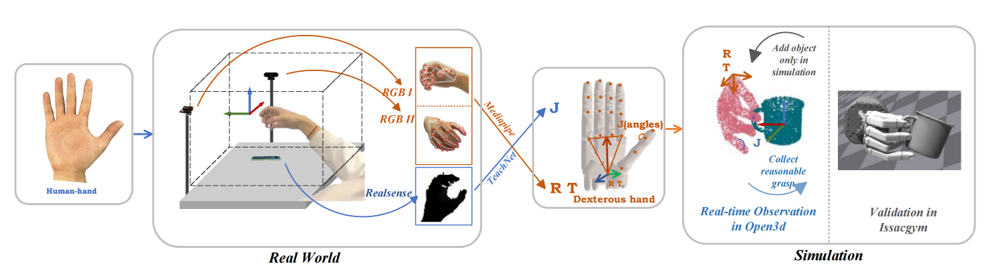

# Annotation system

This folder is for our Annotation system, we use TeachNet mapping human hand to ShadowHand and collect functional dexterous hand grasp. Other dexterous hands collection which use directly angle mapping from ShadowHand are also provided.

## Dependencies

### HardWare
follow the realsense website and install realsense

```bash
two RGB cameras ===== our frame_shape = [720, 1280]
one realsense camera ==== we use Inter SR305

```
- Ubuntu 20.04 (optional)

- Python 3.8

- PyTorch 1.10.1

- Numpy 1.22.0

- mediapipe 0.8.11

- [pytorch-kinematics](https://github.com/PKU-EPIC/DexGraspNet/tree/main/thirdparty/pytorch_kinematics/pytorch_kinematics)  0.3.0 

- [Isaac Gym](https://github.com/) preview 4.0 (3.0)

- CUDA 11.1

### Common Packages

```bash
conda create -n annotate python==3.8.13
conda activate annotate

# Install pytorch with cuda
pip install torch==1.10.1 torchvision==0.11.2 ## or using offical code from pytorch website
pip install numpy==1.22.0
cd Annotation/
cd pytorch_kinematics/ #need download from up link
pip install -e.
cd ..
pip install -r requirement.txt

# Install IsaacGym : 
# download from up link and put in to folder Annotation/
cd IsaacGym/python/
pip install -e .
export LD_LIBRARY_PATH=/home/your/path/to/anaconda3/envs/annotate/lib
```


### Grasp pose collection

*(1)* Follow the instruction from [handpose3d](https://github.com/TemugeB/handpose3d), get the camera_paremeters folder, or use mine.

*(2)* Set the cameras in real as shown in the figure.

*(3)* Create a folder, for example, named ***/Grasp_Pose***.

*(4)* Run .py, which **--idx** means the id of category, and -**-instance** means which object to be grasped, **--cam_1** and **--cam_2** means the ids of them:

```bash
python shadow_dataset_human_shadow_add_issacgym_system_pytorch3d_mesh_new_dataset.py --idx 0 --instance 0 --cam_1 6 --cam_2 4
```

The grasp pose could be saved in dir ***Grasp_Pose/***.

#### Using IsaacGym to verify meanwhile (open an another terminal at the same time).

*(5)* We read the grasp pose file from ***Grasp_Pose/***. and sent to IsaacGym to verify **at the same time**, success grasps and collected success rate will be saved in dir ***refine_pose_sift/***.

```bash
cd..
cd IsaacGym/python
python grasp_gym_runtime_white_new_data.py --pipeline cpu --grasp_mode dynamic --idx 0 --instance 0
```

#### Other dexterous hand collection demo (Optional)
```bash
python shadow_dataset_human_shadow_add_issacgym_system_pytorch3d_mesh_new_dataset_multi_dexterous.py --idx 0 --instance 0 --cam_1 6 --cam_2 4
```
