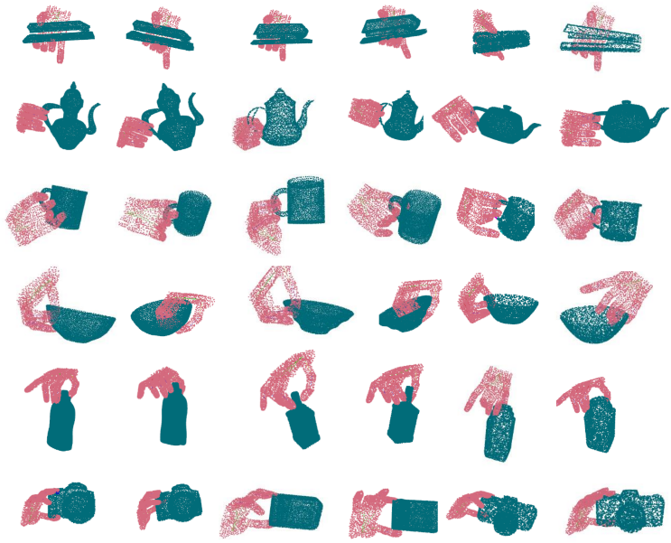
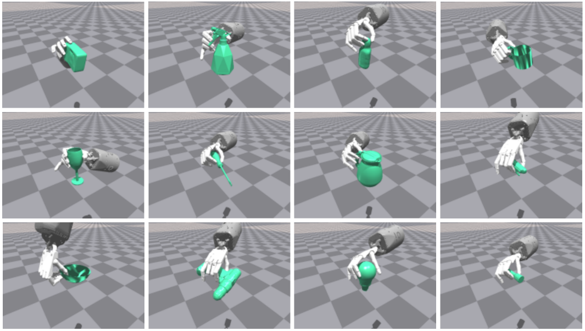

<p align="center">
    <h2 align="center">DexFuncGrasp: A Robotic Dexterous Functional Grasp Dataset constructed 
      from a Cost-Effective Real-Simulation Annotation System (AAAI2024)</h2>
    <p align="center">Jinglue Hang, Xiangbo Lin&dagger;, Tianqiang Zhu, Xuanheng Li, Rina Wu, Xiaohong Ma and Yi Sun;<br />
    Dalian University of Technology<br />
    &dagger; corresponding author<br />
    <a href='https://hjlllll.github.io/DFG/'>project page</a> | 

</p>


## Contents

1. [Abstract](#abstract)

2. [Grasp pose collection](#grasp-pose-collection)

3. [Grasp Transfer for Dataset Extension](#grasp-transfer-for-dataset-extension)

4. [DFG Dataset](#dfg-dataset)

5. [Dexterous Grasp Generation Baseline](#dexterous-grasp-generation-baseline)

6. [Simulation Experiment](#simulation-experiment)

7. [Acknowledgments](#acknowledgments)

8. [Citation](#citation)

9. [License](#license)

## Abstract
<div align=center>


</div>


Robot grasp dataset is the basis of designing the robot’s grasp generation model. Compared with the building grasp dataset for Low-DOF grippers, it is harder for High-DOF dexterous robot hand. Most current datasets meet the needs of generating stable grasps, but they are not suitable for dexterous hands to complete human-like functional grasp, such as grasp the handle of a cup or pressing the button of a flashlight, so as to enable robots to complete subsequent functional manipulation action autonomously, and there is no dataset with functional grasp pose annotations at present. This paper develops a unique Cost-Effective Real-Simulation Annotation System by leveraging natural hand’s actions. The system is able to capture a functional grasp of a dexterous hand in a simulated environment assisted by human demonstration in real world. By using this system, dexterous grasp data can be collected efficiently as well as cost-effective. Finally, we construct the first dexterous functional grasp dataset with rich pose annotations. A Functional Grasp Synthesis Model is also provided to validate the effectiveness of the proposed system and dataset.

## Grasp pose collection
<div align=center>

</div>

- Our Annotation system: we use [TeachNet](https://github.com/TAMS-Group/TeachNet_Teleoperation) mapping human hand to ShadowHand and collect functional dexterous hand grasp. Other dexterous hands collection which use directly angle mapping from ShadowHand are also provided.

### HardWare
- follow the realsense website and install realsense

```bash
two RGB cameras ===== our frame_shape = [720, 1280]
one realsense camera ==== we use Inter SR305

```

### Dependencies

- Ubuntu 20.04 (optional)

- Python 3.8

- PyTorch 1.10.1

- Numpy 1.22.0

- mediapipe 0.8.11

- [pytorch-kinematics](https://github.com/PKU-EPIC/DexGraspNet/tree/main/thirdparty/pytorch_kinematics/pytorch_kinematics)  0.3.0 

- [Isaac Gym](https://github.com/) preview 4.0 (3.0)

- CUDA 11.1

### Common Packages

```bash
conda create -n annotate python==3.8.13
conda activate annotate

# Install pytorch with cuda
pip install torch==1.10.1 torchvision==0.11.2 ## or using offical code from pytorch website
pip install numpy==1.22.0
cd Annotation/
cd pytorch_kinematics/ #need download from up link
pip install -e.
cd ..
pip install -r requirement.txt

# Install IsaacGym : 
# download from up link and put in to folder Annotation/
cd IsaacGym/python/
pip install -e .
export LD_LIBRARY_PATH=/home/your/path/to/anaconda3/envs/annotate/lib
```

### Process steps


- Set the cameras in real as shown in the figure.

- Follow the instruction from [handpose3d](https://github.com/TemugeB/handpose3d), get the camera_paremeters folder, or use mine.

- Create a folder, for example, named ***/Grasp_Pose***.

- Run .py, which **--idx** means the id of category, and -**-instance** means which object to be grasped, **--cam_1** and **--cam_2** means the ids of them:

```bash
python shadow_dataset_human_shadow_add_issacgym_system_pytorch3d_mesh_new_dataset.py --idx 0 --instance 0 --cam_1 6 --cam_2 4
```


#### Using IsaacGym to verify meanwhile (open an another terminal at the same time).

- We read the grasp pose file from ***Grasp_Pose/***. and sent to IsaacGym to verify **at the same time**, success grasps and collected success rate will be saved in dir ***/Tink_Grasp_Transfer/Dataset/Grasps/***.

```bash
cd..
cd IsaacGym/python
python grasp_gym_runtime_white_new_data.py --pipeline cpu --grasp_mode dynamic --idx 0 --instance 0
```

if you think this grasp is good grasp, press blank and poses can be saved, try to collect less than 30 grasps, and click **x** in isaacgym in the top right to close. The grasp pose could be saved in dir ***Grasp_Pose/***.

- After collection, unit axis for grasps in ***/Tink_Grasp_Transfer/Dataset/Grasps/*** in order to learn sdf function of each category.
```bash
python trans_unit.py 
```

- Other dexterous hand collection demo (Optional)
```bash
python shadow_dataset_human_shadow_add_issacgym_system_pytorch3d_mesh_new_dataset_multi_dexterous.py --idx 0 --instance 0 --cam_1 6 --cam_2 4
```


## Grasp Transfer for Dataset Extension
<div align=center>

</div>

### Dependencies
- [Tink](https://github.com/oakink/Tink) , this part is modified from Tink(OakInk)
- git clone https://github.com/oakink/DeepSDF_OakInk
follow the instruction and install all requirements:
The code is in C++ and has the following requirements: (using the same conda env annotate)

- [CLI11][1]
- [Pangolin][2]
- [nanoflann][3]
- [Eigen3.3.9][4]

[1]: https://github.com/CLIUtils/CLI11
[2]: https://github.com/stevenlovegrove/Pangolin
[3]: https://github.com/jlblancoc/nanoflann
[4]: https://eigen.tuxfamily.org


### Common Packages

```bash
pip install termcolor
pip install plyfile

### prepare mesh-to-sdf env
git clone https://github.com/marian42/mesh_to_sdf
cd mesh_to_sdf
pip install -e.


pip install scikit-image==0.16.2

put download packages in Transfer/third-party/
cd CLI11 # cd Pangolin/nanofl...
mkdir build
cd build
cmake ..
make -j8 
```

### Process steps
- The same process using Tink.
```bash
python generate_sdf.py --idx 0
python train_deep_sdf.py --idx 0
python reconstruct_train.py --idx 0 --mesh_include
python tink/gen_interpolate.py --all --idx 0
python tink/cal_contact_info_shadow.py --idx 0 --tag trans
python tink/info_transform.py --idx 0 --all
python tink/pose_refine.py --idx 0 --all #--vis
```

- Or directly bash: 
```bash
sh transfer.sh
```

- Only save the success grasp and unit axis of dataset:
```bash
cd ../../../IsaacGym/python/collect_grasp/
# save the success grasp
python grasp_gym_newdata_clean.py 
# unit axis of dataset
python trans_unit_dataset_func.py
```
- Till now, the grasp dataset in folder: ***Annotation/Tink_Grasp_Transfer/Dataset/Grasps***, each grasps used for training in /0_unit_025_mug/sift/unit_mug_s009/new, which object quat are all [1 0 0 0], at same axis.


## DFG Dataset 

<div align=center>

</div>

- We collect grasps through steps above. And name DFG dataset.
- Download source meshes and grasp labels for 12 categories from [DFG](https://shapenet.org/download/shapenetcore) dataset.
- Arrange the files as follows:
```
|-- DFG_dataset
    |-- Annotation
        |-- DFG_dataset
            |-- Grasps
                |-- mug
                |-- bowl
                |-- bottle
                |-- camera
                | ...
```

## Dexterous Grasp Generation Baseline 
<div align=center>

</div>

- As we propose this dataset, we provide the baseline method based on CVAE as follows:

## Simulation Experiment
<div align=center>

</div>

## Acknowledgments

This repo is based on [TeachNet](https://github.com/TAMS-Group/TeachNet_Teleoperation), [handpose3d](https://github.com/TemugeB/handpose3d), [OakInk](https://github.com/oakink/Tink), [DeepSDF](https://github.com/oakink/DeepSDF_OakInk),  [TransGrasp](https://github.com/yanjh97/TransGrasp), [6dofgraspnet](https://github.com/jsll/pytorch_6dof-graspnet), [VRCNET](https://github.com/paul007pl/VRCNet). Many thanks for their excellent works.

And our previous works about functional grasp generation as follows: [Toward-Human-Like-Grasp](https://github.com/zhutq-github/Toward-Human-Like-Grasp), [FGTrans](https://github.com/wurina-github/FGTrans), [Functionalgrasp](https://github.com/hjlllll/Functionalgrasp).
## Citation

```BibTeX
@inproceedings{
}
```
## License

Our code is released under [MIT License](./LICENSE).